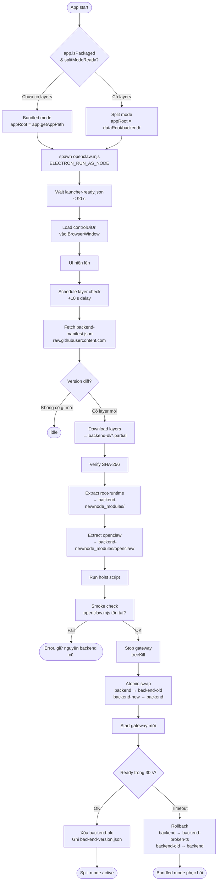
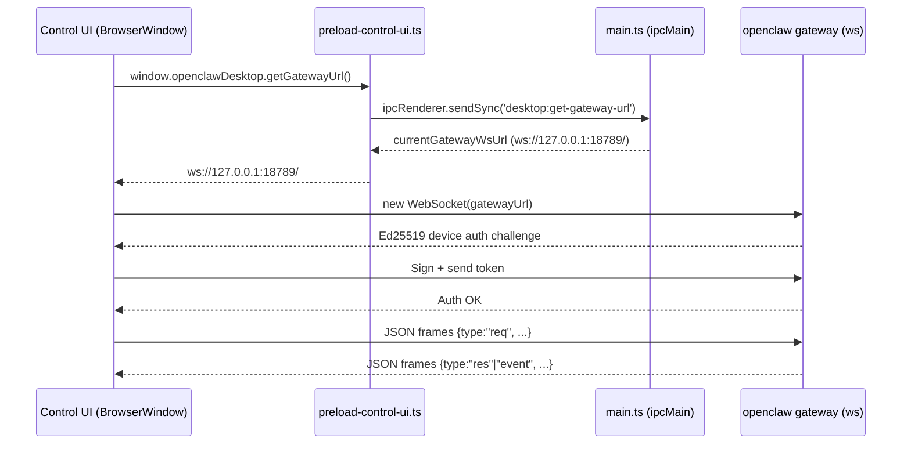
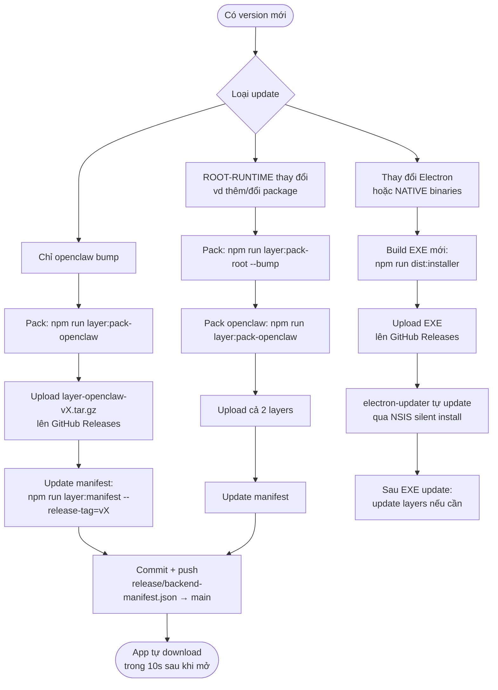

# OpenClaw Desktop — Kiến trúc, Đóng gói & Vận hành

> Tài liệu kỹ thuật cho team. Cập nhật: 2026-04-14

---

## 1. Tổng quan kiến trúc

OpenClaw Desktop là Electron wrapper của `openclaw` (gateway AI). Hệ thống tách backend thành **2 lớp có thể cập nhật độc lập** mà không cần build lại EXE.

```
┌─────────────────────────────────────────────────────────────────┐
│                    OpenClaw Desktop (EXE)                       │
│                                                                 │
│  ┌─────────────────────────┐   ┌─────────────────────────────┐  │
│  │     Electron Main       │   │    BrowserWindow            │  │
│  │  (app/main/main.ts)     │   │                             │  │
│  │                         │   │  vendor/control-ui/         │  │
│  │  - Spawn gateway        │   │  (forked Lit Web Components)│  │
│  │  - Layer updater        │   │                             │  │
│  │  - Auto-updater (NSIS)  │   │  ← IPC: getGatewayUrl()     │  │
│  └─────────┬───────────────┘   └─────────────────────────────┘  │
│            │ spawn (ELECTRON_RUN_AS_NODE)                        │
│            ▼                                                     │
│  ┌─────────────────────────┐                                    │
│  │  openclaw gateway       │  ws://127.0.0.1:<port>/            │
│  │  (openclaw.mjs)         │  ← Control UI kết nối vào đây     │
│  └─────────────────────────┘                                    │
└─────────────────────────────────────────────────────────────────┘
```

### 2 chế độ chạy backend

| Chế độ | Điều kiện | OPENCLAW_APP_ROOT |
|--------|-----------|-------------------|
| **Bundled** | Lần đầu cài, chưa có layers | `app.getAppPath()` |
| **Split** | `backend/node_modules/openclaw/openclaw.mjs` tồn tại | `%APPDATA%\OpenClaw Desktop\backend\` |

---

## 2. Sơ đồ luồng khởi động



---

## 3. Sơ đồ kết nối UI ↔ Gateway



**Trường hợp Docker/Headless:** User tự nhập `gatewayUrl` trong Settings của UI. Không cần IPC — `storage.ts` lưu URL vào localStorage và dùng trực tiếp.

---

## 4. Những file được đóng gói

### 4.1 EXE Installer (`Openclaw-Desktop-Setup-1.0.0.exe`)

Build bằng `npm run dist:installer`. Chứa:

```
dist/
  main/main.js          ← Electron main process (TypeScript compiled)
  main/layer-updater.js
  main/backend-manifest.js
  main/preload-control-ui.js
  backend/config.js
assets/icon.ico
package.json
node_modules/
  electron/             ← Electron runtime
  openclaw/             ← BUNDLED (dùng ở bundled mode, sẽ bỏ ở Bước 5)
  axios/
  tree-kill/
  electron-updater/
  [tất cả ROOT_ONLY & NATIVE packages]
vendor/
  control-ui/           ← Forked Lit UI (build bằng npm run ui:build)
    index.html
    assets/*.js
    assets/*.css
resources/
  workspace/            ← Workspace files
```

**Loại khỏi EXE** (tiết kiệm ~200 MB):

| Pattern | Lý do |
|---------|-------|
| `node_modules/openclaw/docs/**` | Documentation |
| `node_modules/openclaw/dist/extensions/*/node_modules/**` | Đã hoist lên root |
| `node_modules/node-llama-cpp/llama/**` | Prebuilt native runners |
| `node_modules/pdfjs-dist/web/**`, `legacy/**` | Browser-only |
| `node_modules/playwright-core/.local-browsers/**` | Cần `playwright install` riêng |
| `node_modules/**/*.d.ts`, `*.map` | Dev-only |
| `node_modules/**/test/**`, `__tests__/**` | Test files |

### 4.2 Layer tarballs (GitHub Releases)

Upload lên `mankhb2k/openclaw-desktop` → Releases:

| File | Kích thước | Nội dung | Update tần suất |
|------|-----------|----------|-----------------|
| `layer-openclaw-v2026.4.5.tar.gz` | ~380 MB nén | `node_modules/openclaw/` + hoist deps | Mỗi khi openclaw bump version |
| `layer-openclaw-v2026.4.5.tar.gz.sha256` | tiny | SHA-256 checksum | Cùng lúc với tar.gz |
| `layer-root-runtime-v1.tar.gz` | ~35 MB nén | ROOT_ONLY packages (98 packages) | Vài tháng 1 lần |
| `layer-root-runtime-v1.tar.gz.sha256` | tiny | SHA-256 checksum | Cùng lúc với tar.gz |

### 4.3 Manifest (commit vào repo)

`release/backend-manifest.json` — commit vào nhánh `main`:

```jsonc
{
  "schemaVersion": 2,
  "electronVersion": "35.7.5",     // phải match EXE
  "platform": "win32",
  "arch": "x64",
  "layers": {
    "root-runtime": {
      "version": "1",
      "sha256": "<hex>",
      "url": "https://github.com/Mankhb2k/openclaw-desktop/releases/download/v1.0.0/layer-root-runtime-v1.tar.gz",
      "extractTo": "node_modules",
      "requiresHoist": false
    },
    "openclaw": {
      "version": "2026.4.5",
      "sha256": "<hex>",
      "url": "https://github.com/Mankhb2k/openclaw-desktop/releases/download/v1.0.0/layer-openclaw-v2026.4.5.tar.gz",
      "extractTo": "node_modules",
      "requiresHoist": true,
      "hoistScript": "scripts/hoist-openclaw-ext-deps.mjs"
    }
  },
  "extractOrder": ["root-runtime", "openclaw"],
  "minAppVersion": "1.0.0"
}
```

App fetch manifest từ:
```
https://raw.githubusercontent.com/mankhb2k/openclaw-desktop/main/release/backend-manifest.json
```

---

## 5. Sử dụng với Docker / Headless Gateway

Control UI đã được fork và có thể kết nối đến **bất kỳ** openclaw gateway nào — không bị lock vào `127.0.0.1`.

### 5.1 Kết nối từ Desktop App đến Docker gateway

1. Mở OpenClaw Desktop
2. Vào **Settings → Gateway URL**
3. Thay `ws://127.0.0.1:18789/` → `ws://<docker-host>:<port>/`
4. Reload — UI kết nối đến Docker gateway

### 5.2 Chạy Control UI standalone (không cần Desktop App)

Build UI rồi serve như static file:

```bash
# Build
npm run ui:build
# Output: vendor/control-ui/index.html

# Serve bằng bất kỳ static server
npx serve vendor/control-ui -p 8080
# Mở browser: http://localhost:8080
# Nhập Gateway URL: ws://your-docker-host:18789/
```

### 5.3 Deploy UI kèm docker-compose

```yaml
services:
  openclaw:
    image: openclaw/headless:latest
    ports:
      - "18789:18789"

  control-ui:
    image: nginx:alpine
    volumes:
      - ./vendor/control-ui:/usr/share/nginx/html:ro
    ports:
      - "8080:80"
```

UI tự nhận gateway từ cùng domain (same-origin) nếu dùng reverse proxy, hoặc user nhập thủ công.

### 5.4 Biến môi trường hữu ích

| Biến | Dùng cho | Ví dụ |
|------|----------|-------|
| `OPENCLAW_BACKEND_MANIFEST_URL` | Override manifest URL để test local | `file:///C:/dev/manifest.json` |
| `OPENCLAW_CONTROL_UI_BASE_PATH` | Base path của UI khi serve không ở `/` | `/ui/` |

---

## 6. Quy trình update

### 6.1 Sơ đồ quyết định update



### 6.2 Quy trình update nhanh (chỉ openclaw)

```bash
# 1. Cập nhật openclaw trong package.json, rồi npm install
npm install openclaw@2026.5.0

# 2. Pack layer mới
npm run layer:pack-openclaw
# → release/layer-openclaw-v2026.5.0.tar.gz

# 3. Upload lên GitHub Release (tag mới v1.0.1)
gh release create v1.0.1 \
  release/layer-openclaw-v2026.5.0.tar.gz \
  release/layer-openclaw-v2026.5.0.tar.gz.sha256

# 4. Tạo manifest mới
npm run layer:manifest -- --release-tag=v1.0.1
# → release/backend-manifest.json (cập nhật openclaw.version + sha256 + url)

# 5. Commit manifest vào main
git add release/backend-manifest.json
git commit -m "feat: openclaw layer v2026.5.0"
git push origin main

# Xong — app tự fetch manifest và download layer mới
```

### 6.3 Quy trình update đầy đủ (cả 2 layers)

```bash
npm run layer:all
# Chạy theo thứ tự:
#   layer:check        ← Validate không có overlap
#   layer:pack-root    ← Pack ROOT-RUNTIME
#   layer:pack-openclaw ← Pack OPENCLAW
#   layer:manifest     ← Generate manifest
#   layer:smoke        ← Smoke test cả 2 layers

# Sau đó upload và commit manifest (bước 3-5 ở trên)
```

---

## 7. Quy định triển khai cho team

### 7.1 Quy tắc bất biến (KHÔNG được vi phạm)

| # | Quy tắc | Lý do |
|---|---------|-------|
| **RULE-01** | NATIVE packages (`optionalDependencies`) LUÔN ở trong EXE, KHÔNG ở trong layers | NATIVE cần Electron ABI — nếu download sẽ không chạy được |
| **RULE-02** | Sau mỗi extract PHẢI verify `openclaw.mjs` tồn tại | Nếu extract lỗi mà không rollback → app crash |
| **RULE-03** | Sau mỗi extract OPENCLAW PHẢI chạy hoist script | Extensions cần deps ở `node_modules/` root |
| **RULE-04** | WITH_OC packages KHÔNG ở trong ROOT-RUNTIME layer | Trùng lặp → conflict khi extract |
| **RULE-05** | Extract ROOT-RUNTIME TRƯỚC, OPENCLAW SAU | openclaw có thể override deps của root-runtime |
| **RULE-06** | Atomic swap: extract vào `backend-new/`, swap khi xong | Không bao giờ extract thẳng vào `backend/` đang chạy |
| **RULE-07** | Rollback tự động nếu gateway không ready trong 30s | User không bao giờ thấy app broken |
| **RULE-08** | Manifest URL phải là `raw.githubusercontent.com` | CDN cache, không cần auth, nhất quán |

### 7.2 Trước mỗi release, checklist bắt buộc

```markdown
- [ ] npm run layer:check  →  "All checks passed"
- [ ] npm run layer:smoke  →  Không có error
- [ ] SHA-256 trong manifest khớp với file tar.gz thực tế
- [ ] backend-manifest.json đã commit vào main (KHÔNG phải nhánh khác)
- [ ] `minAppVersion` trong manifest ≤ version EXE hiện tại của user
- [ ] `electronVersion` trong manifest = Electron version trong package.json
- [ ] Test local: npm run layer:install-local → restart app → log hiện "Split mode"
```

### 7.3 Phân loại package — ai quyết định layer nào?

```
package mới cần thêm
        │
        ▼
    optionalDependencies? ──Yes──► NATIVE (vào EXE, KHÔNG đóng gói layer)
        │
        No
        ▼
    openclaw cũng dùng package này? ──Yes──► WITH_OC (KHÔNG đóng gói layer riêng)
        │                                    (openclaw layer đã có sẵn)
        No
        ▼
    ROOT_ONLY ──► Đóng vào ROOT-RUNTIME layer + bump version
```

Để kiểm tra phân loại hiện tại:
```bash
npm run layer:check -- --verbose
```

### 7.4 Không được làm

- ❌ Sửa `backend-manifest.json` bằng tay — luôn dùng `npm run layer:manifest`
- ❌ Upload layers lên GitHub rồi quên commit manifest — app sẽ dùng manifest cũ
- ❌ Bump `minAppVersion` cao hơn version EXE đang phát hành — user không update được
- ❌ Xóa GitHub Release đang được manifest trỏ đến — app download sẽ 404
- ❌ Push manifest vào nhánh khác `main` — app hardcode fetch từ `main`
- ❌ Thêm NATIVE package vào ROOT-RUNTIME layer — sẽ crash trên máy user

### 7.5 Thứ tự ưu tiên khi có conflict

```
Electron ABI (NATIVE)  >  openclaw version  >  ROOT-RUNTIME version
```

Nghĩa là: nếu cần nâng Electron → build EXE mới → pack lại tất cả layers → update manifest.

---

## 8. Cấu trúc thư mục runtime (trên máy user)

```
%APPDATA%\OpenClaw Desktop\
├── launcher-ready.json       ← Ghi bởi gateway khi ready (port, URL)
├── backend-version.json      ← Ghi bởi layer-updater sau swap thành công
├── backend-dl\               ← Download cache (xóa sau khi extract xong)
│   └── *.tar.gz.partial
├── backend\                  ← Active backend (Split mode root)
│   ├── node_modules\
│   │   ├── openclaw\
│   │   │   └── openclaw.mjs  ← Existence = Split mode trigger
│   │   └── [ROOT_ONLY packages]
│   └── [hoist output]
├── backend-new\              ← Staging area trong quá trình update
├── backend-old\              ← Backup trong 30s grace period
└── backend-broken-<ts>\      ← Lưu lại khi rollback để debug
```

---

## 9. Debug & Troubleshooting

### App không vào Split mode

```bash
# Kiểm tra file trigger tồn tại chưa
ls "%APPDATA%\OpenClaw Desktop\backend\node_modules\openclaw\openclaw.mjs"

# Nếu chưa có, install thủ công:
npm run layer:install-local
```

### Layer download bị lỗi

Kiểm tra DevTools Console trong app → tab Network hoặc Console:
- Event `backend:layer-update-state` với `phase: "error"`
- Hoặc set biến môi trường trước khi chạy app:

```bash
set OPENCLAW_BACKEND_MANIFEST_URL=file:///C:/path/to/local-manifest.json
```

### Rollback bất ngờ

Xem `backend-broken-<timestamp>/` để debug:
```bash
ls "%APPDATA%\OpenClaw Desktop\"
# Tìm thư mục backend-broken-*
# Kiểm tra node_modules/openclaw/openclaw.mjs có trong đó không
```

### Build UI bị lỗi

```bash
cd control-ui
npm install          # Cần chạy lần đầu
npm run build
# Output: ../vendor/control-ui/
```
